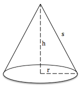
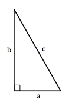

# Assignment 5 - Mathematical methods

## Learning outcomes
The student must show ability and skill in creating and using methods in their program logic to encapsulate code in reusable sections and to create larger programs.

## Prerequisites
The assignment presupposes that you have studied the material in step 5 and bring with you knowledge and feedback from previous assignments.

## Task
This task involves you creating a number of methods that perform various mathematical tasks and calling these into the main method.

Begin the task by constructing a flow chart and program logic on paper. Then describe your structure in text form (pseudocode) in the comment header of the program and in the method comments so that an outsider can understand what the program does and how your logic / algorithm works.

## Area and volume
A cone is a geometric figure that has a base surface and a mantle surface that is formed into a tip from the base surface. If the base surface has the shape of a circle and the tip of the cone is directly above or below the center of the circle, then we call the cone a straight, circular cone.



## Base area / Area of the circle
You must create a method `area(int radius)` that takes in the radius (positive number) and calculate the base area, in other words the area of ​​the circle.

The area is returned from the method as a floating point number.

The base area is calculated as 

To calculate the power (eg base r raised to exponent 2), use the ready-made java method `Math.pow(double a, double b)` where a is base and b is exponent.

## Surface area / Area of the tip of cone
You must create a method `area(int radius, int height)` that takes in the radius and height and calculate the area of ​​the mantle surface, ie the area of ​​the tip.

The area is returned from the method as a floating point number.

The area of ​​the mantle surface is calculated as 


(how to obtain s is described in the next section)

Note that you will have two methods called area, this is a requirement for passing. Having two (or more) methods with the same name is called overlay and it is the number and type of input parameters that determines which of the methods is run.

## Pythagoras' theorem
To calculate the area of ​​the mantle surface, we must first obtain s (ie the hypotenuse) and for that we use Pythagoras' theorem:




You should create a method `pythagoras(int sideA, int sideB)` that takes in a and b (positive numbers) and returns the hypotenuse c as a floating point number.

To get the square root of a number, use the ready-made java method `Math.sqrt(double a)`.

## Volume
You must create a method `volume(int radius, int height)` that takes in radius and height (positive numbers) and calculate the volume.

The volume is returned from the method as a floating point number.

Calculation of the cone's volume is done with the following formula:


## Fractions
### Calculation
You should create a method `fraction(int denominator, int denominator)` that takes in a numerator and a denominator and converts these into an integer part and a fraction and shortens the fraction part as far as possible.

The result must be returned in an integer array, int\[3], where the integer part is in first place in the array and the fraction's numerator and denominator are in second and third place in the array.

If the denominator submitted is 0, the division should not be implemented and the method should instead return null (since division with 0 cannot be done). If the numerator submitted is 0, the method must return {0, 0, 0}

Example:

Numerator 7 and denominator 3 should give the result 2 1/3, so the method returns an array that contains {2, 1, 3}.

The conversion is done as follows:

- Divide the numerator by the denominator (integer division): 7/3
  - The quota gives us the integer part: 2
  - The rest gives us the fraction's numerator: 1
- The denominator of the fraction becomes the same as the constituent denominator: 3

The fraction part must therefore also be shortened, which means that we must find the greatest common divider and divide both the numerator and the denominator by it. To find the largest common divider, we create a method, gcd, see below.

### Shortening
We will shorten the fraction by finding the largest common divider using Euclide's algorithm.

You must create a method `gcd(int a, int b)` and it must take in two integers.

```
1. Make sure that a> b (change place if necessary)
2. As long as b is not 0
      2.1 c = a% b
      2.2 a = b
      2.3 b = c
3. Return a
```

### Printing
You should create a `printFraction(int[] parts)` method that takes an integer array and presents it as "integer numerator / denominator".

If the first place in the array is 0, it means that there is no integer part, if the second place in the array is 0, there is no fraction part and if the last place in the array is 0, the printout should be 0.

If the array is null, the text "Error" should be printed.

The table below shows examples of what to print depending on what is in the array:

| Array | Print |
| --- | ----------- |
| {2, 1, 3} | 2 1/3 |
| {0, 2, 5} | 2/5 |
| {3, 0, 7} | 3 |
| {0, 0, 0} | 0 |
| null | "Error" |

### Input
You must create a method `input()` that reads the user's input and returns a positive integer. You should define the value to be returned when the user enters "q" and manage when the user enters an invalid value (see the heading Error Checks).

## Testing of methods
The main program, ie the main method, must test the methods, ie call methods with input parameters that are retrieved from the user's input data.

Your program should repeatedly load a radius and height (in that order) and test the two area methods and the volume method until the user enters 'q'. Then the program should continue but now it should instead read in numerator and denominator (in that order) and test the fraction part, this is repeated until the user enters 'q' again when the program should end.

Appropriate prints are made in the program to be able to follow how the program works, see example. Return values ​​from the area and volume methods are printed by the main method, rounded to two decimal places when printing. The fraction of the fraction is printed via the printFraction method. Note that it is only the result of the fraction part, which is printed via printFraction, ie the answer that you get back from the method fraction. A printout of the numerator and denominator that you enter as well as the equal sign that precedes the answer in the example below is thus printed directly in main.

See also this flow chart


Begin the task by constructing a flow chart and program logic on paper. This should be transmitted in text form to the comment header of the program.

Below you see an example of how the program should work, the example is designed so that the program can be quickly and easily tested for correction, so follow it as closely as possible.

```
----------------------------------
# Test of area and volume methods
----------------------------------
> 2 4 3 5 q
r = 2 h = 4
Basytans area: 12.57
Mantelytans area: 28.10
Volume: 16.76

r = 3 h = 5
Basytans area: 28.27
Mantle area: 54.96
Volume: 47.12

----------------------------------
# Test of the fractional methods
----------------------------------
> 7 3 12 3 9 0 5 7 q
   7/3 = 2 1/3
  12/3 = 4
   9/0 = "Error"
   5/7 = 5/7
```
It should therefore be possible to enter several values before pressing enter (after enter input is sent to the Scanner object). As usual, you use the Scanner methods hasNext ... to check the data type and next ... to load one value at a time from the input buffer (until the next separator). The remaining values then remain in the input buffer and wait their turn to be loaded.

Note that this only works if you create the Scanner object only once in the program. You must create a separate method for all inputs, so it is advisable to declare the Scanner object in the class body instead of in the method, so that the same Scanner object can be used for all inputs.

NOTE! The scanner variable is the only variable that can be declared in the class body.

## Error checks
All inputs in the program are integers, except 'q' which ends the program. Input of anything other than integers or 'q' should be ignored. The program should not crash regardless of what the user enters (eg if, for example, you happen to enter a letter or a floating point number instead of an integer).

The reading should be repeated as long as the user does not type a 'q'. Entering 'q' should cause the program to skip to the next part (or end).

If the user enters a negative number for radius or height, this number should be converted to a positive by taking the absolute amount of the number: `a = Math.abs (a);`

## Submit the solution
Before submitting the file, check that your code follows the course's requirements for formatting and coding rules (see corresponding criteria in the correction matrix on replit). 

## Plagiarism 
When writing the code, make the code your own. Submissions may be checked for plagiarism and in the event of cheating risk the student reporting to the university's Disciplinary Board.

## Correction
If you submit on time, you should normally have the information corrected no later than 3 weeks after the deadline. 

NOTE! If you encounter problems so you can not complete the task, ask the supervisor instead of submitting a half-finished solution. 

The teacher marks how well the code meets resp. the criterion in the correction matrix. Submissions that do not reach the lowest level of compliance will fail. Any failed submissions must be reworked to achieve an approved level and then resubmitted (click on "Submit again").  